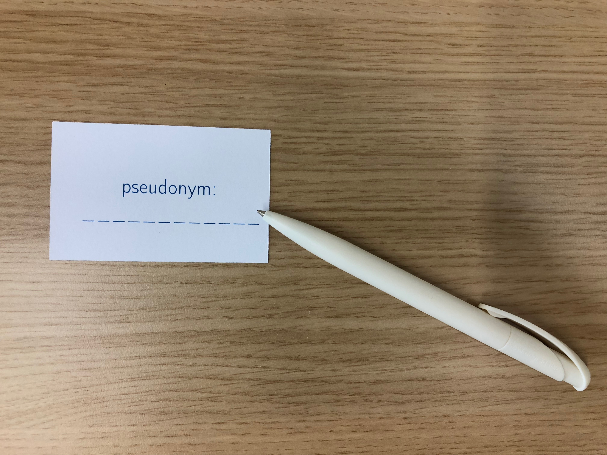
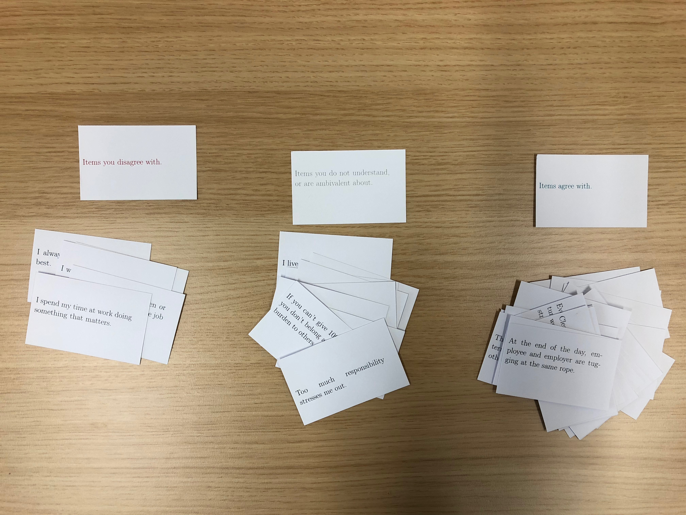
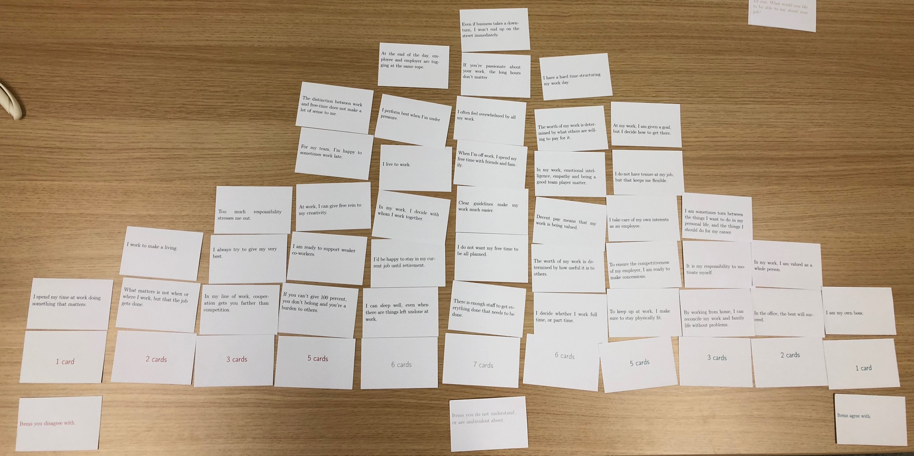
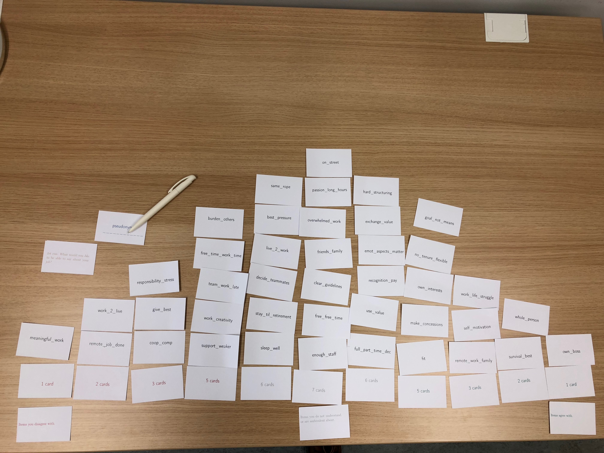

<div class="jumbotron" style="color:white; background: linear-gradient( rgba(0, 0, 0, 0), rgba(0, 0, 0, 0.7) ), url(img/murray.jpg) no-repeat center center fixed; -webkit-background-size: cover; -moz-background-size: cover; -o-background-size: cover; background-size: cover;">
  <h2>Imagine you are in a time loop: What would you do?</h1>
  <p>A Q study on a thought experiment.</p>
  <p>
    <span class="label label-info">
      #GroundhogDay #rstats #QMethodology
    </span>
  </p>
  <p><small><sub>
    Image Credit: Groundhog Day (Columbia Pictures 1993), via [IMDB](https://www.imdb.com/title/tt0107048/)
  </sub></small></p>
</div>

```{r, child="README.rmd"}
```

```{r setup, include = FALSE}
library(readr)
library(magrittr)
library(fs)
library(purrr)
```


---

## Introduction

## Item Generation

### Q-Distribution

```{r include = FALSE}
distro <- qmethod::make.distribution(nstat = 59, max.bin = 7)
names(distro) <- -7:7
# TODO there is a bug here; this should work without specifiyng chessboard, null should default fine
grid <- pensieve::as_psGrid(obj = distro, pattern = "chessboard")
```

### Plotting Items

```{r, eval=FALSE, include=FALSE}
items <- readr::read_csv(file = "https://docs.google.com/spreadsheets/d/e/2PACX-1vSkT1N44FpPcqAcAp1eChsHI0jlw-F0gqB7w1Sl4ksd6q3vNAoBbkjrx0rjlYc_7hhJiZ0uHvmxKRon/pub?gid=0&single=true&output=csv")
readr::write_rds(x = items, path = "items.rds")
```

```{r items, include = FALSE}
raw_items <- readr::read_rds(path = "items.rds")
items <- matrix(
  data = as.matrix(raw_items[,c("english", "german")]),
  nrow = nrow(raw_items),
  dimnames = list(items = raw_items$shorthandle, languages = c("english", "ngerman"))
)
# write out hashes and df
hash_de <- sapply(X = items[, "ngerman"], FUN = function(x) {
  digest::digest(object = x, algo = "crc32", serialize = FALSE)
})
hash_en <- sapply(X = items[, "english"], FUN = function(x) {
  digest::digest(object = x, algo = "crc32", serialize = FALSE)
})
input_helper_df <- data.frame(
  full_en = items[,"english"],
  full_de = items[,"ngerman"],
  handle = rownames(items),
  hash_en = hash_en,
  hash_de = hash_de
)
readr::write_csv(x = input_helper_df, path = "input_helper.csv")
```

```{r plot-items, eval=FALSE, include=FALSE}
library(qmethod)
qmethod::make.cards(
  q.set = items,
  study.language = "english", 
  output.pdf = TRUE, 
  babel.language = "english", 
  show.handles = FALSE, 
  duplex.double = TRUE, 
  wording.font.size = "\\large",
  file.name = "english")
qmethod::make.cards(
  q.set = items,
  study.language = "ngerman", 
  output.pdf = TRUE, 
  babel.language = "ngerman", 
  show.handles = FALSE, 
  duplex.double = TRUE, 
  wording.font.size = "\\large",
  file.name = "german")
```


## Field Work

Participants were given the following prompt:

> Imagine that, starting now, the next week will repeat itself once.
> In a week, the whole universe will rewind to today, all changes are undone and memories erased.
> You are the only person who knows this, and you alone will remember what happened during this week.
> What would you do?
>
> Rank the following items according to your likelihood for enacting them in the next week.
> Rank all activities highly which you like, even if you could not complete them all in the given time.
>
> Remember that whatever you do in the next seven days would be completely undone at the end of the week; only your memories remain.


Or, in German:

> Stelle dir vor, dass sich die nächste Woche genau ein Mal wiederholt.
> Am Ende der Woche dreht sich die Zeit zurück auf den heutigen Tag. Alle Veränderungen sind revidiert und Erinnerungen gelöscht.
> Du bist die einzige Person, die über diese Wiederholung weiß und nur du kannst dich in Zukunft daran erinnern, was in der Woche passiert ist.
>
> Sortiere die folgenden Aktivitäten danach, wie wahrscheinlich du sie in der Woche durchführen würdest.
> Es ist nicht wichtig, ob du die präferierten Aktivitäten auch alle schaffen könntest.
>
> Denke daran, dass alle Änderungen im Universum am Ende der Woche rückgängig gemacht werden; nur deine Erinnerungen bleiben.


Participants were given the following sorting instructions:

> 1. Choose a pseudonym, so that you can recognize your own datapoints in the results.
    
> 1. Read through all the items carefully. 
     Make notes on the items if you like.
> 2. Preliminarily sort the items into three piles:
     1. Items you like.
     2. Items you do not understand or are ambivalent about.
     3. Items you dislike.
     
> 3. Rank-order the items according to how likely you are to do the described activities, from the right (likely to do) to the left (unlikely to do).
      Start with items from the right (likely to do), continue with items from the left (unlikely to do), and finally fill in the middle (ambivalent).
> 4. Consider your completed sort, and revise item positions if necessary.
      
> 5. Add comments to items you feel strongly about, or do not understand.
> 6. Turn all items on their back (only showing a random string), and ask the investigator to take a picture of your completed sort.
    


Participants were reminded:

> - There is no correct or consistent way to complete your Q sort; whatever you feel expresses your subjective view on the matter is correct. 
>   This is not a test - There is no "right answer".
> - Only the horizontal dimension (from left to right) matters; the vertical axis does not matter.
  Items on top of one another merely express ties.
> If you are ambivalent about an item or do not understand it, place it in the middle between the two extremes.
  This is valuable information, too.
> - You must place all items.
> - You must adhere to the distribution.
> - Only *relative* positions matter.
    For example, you may feel positively about *more* than half of the items, and have only very few neutral or negative items.


Important notes for **the investigators**:

- Remember to sample a *diverse* group of people who are likely to display *different* viewpoints on the subject matter.
- We are not going to gather *any* personal data.
  Make sure not to pollute the gathered data with any information that might deanonymize your participants.
  For example *do not* record their email adress on the cards, and make sure that their pseudonyms are properly anonymous.
  If you want to email the results to the participants, store their contact information *separately* and securely, with no reference to the study.
- **Make sure to test the photo you're taking at the end to record the sort**: 
    - Are the item codes legible? 
    - Is the lighting ok?
    - Is the resolution high enough?
    - Is the pseudonym card in the picture?
    - Save several copies of these images.
    - (If possible, delete date and location metadata from these images).
- There may be a tradeoff in our study between a) getting deep, qualitative insights from observing and discussing the sorting behavior and b) avoiding social desirability biases.
  Participants may not feel free to sort some items (e.g. anti-social and sexual), when they are closely observed, or know that the investigator (= you), will "know" their Q sort.
  (For this reason, the item backs are marked with arbitrary codes for identification, so that participants never have to "show" their sorts to the investigators.)
  It's not clear what we should do here, because on the other hand, we probably cannot produce proper anonymity in in-person sorts, and we may also want to closely observe and engage the participants.
- Take the time to carefully discuss the sorting procedure with participants after they are done.
  If you want to (see above caveat), also sit next to them while they sort and prompt them to explain their choices.
  **Take notes!**
- Remind participants to add feedback or any thoughts and comments to the items.
  They can write them on the cards.
  **Provide participants with pens or pencils.**
- When you are preparing the cards, make sure that every participant has a complete set (and no duplicates). 
  This can be quite difficult and requires *very* careful preparation (envelopes are useful).
- Explain the procedure very carefully to the participants, and **show them pictures of the completed sorts**.
  Otherwise, it can be quite hard to understand the methodology.
  In particular, remind them that only the horizontal axis matters, what the extremes are, and that they must adhere to the forced distribution.
- This procedure takes time and some quiet patience (> 60 minutes), as well as some space (e.g. a free table).
  Plan accordingly.


### Gathered Data

- Max gathered **2** sorts. [^ownsort]
- Patrick gathered **8** sorts. [^ownsort]
- Eleni gathered **8** sorts. [^ownsort]
- Valeria gathered **9** sorts.
- Maria gathered **6** sorts.

[^ownsort]: This includes one sort completed by the author himself.

```{r data-import, include=FALSE, eval=FALSE}
library(googlesheets)
# this is the sheet
groundhog_entry <- gs_title(x = "groundhog-entry", verbose = TRUE)
gs_read(ss = groundhog_entry, ws = "Item Feedback", range = "C1:R60", col_names = TRUE) %>% 
  write_csv(path = "rawdat/item_feedback.csv", append = FALSE, col_names = TRUE)
all_ws <- gs_ws_ls(groundhog_entry)
parts <- all_ws[!(all_ws %in% c("input_helper", "input-template", "Item Feedback"))]
walk(.x = parts, .f = function(x) {
  gs_read(ss = groundhog_entry, ws = x, range = c("A3:O9"), col_names = as.character(-7:7), na = c("#N/A")) %>% 
    write_csv(path = fs::path("rawdat", "sorts", x, ext = "csv"), append = FALSE, col_names = TRUE)
})
```

```{r data-cleaning, include = FALSE}
# rootsorts <- fs::path("..", "groundhog", "rawdat", "sorts")
library(pensieve)
lookup <- readr::read_csv(file = "input_helper.csv")
rootsorts <- fs::path("rawdat", "sorts")
filenames <- fs::dir_ls(rootsorts, recursive = FALSE, all = FALSE, type = "file", glob = "*.csv")
persons <- fs::path_file(filenames)
persons <- fs::path_ext_remove(persons)
rawdat <- purrr::map(.x = persons, .f = function(x) {
  cat(x)
  path <- fs::path(rootsorts, x, ext = "csv")
  thissort <- readr::read_csv(file = path, col_names = TRUE)
  thissort <- as.matrix(thissort)
  # TODO hackfix
  attr(thissort, "pattern") <- "chessboard"
  class(thissort) <- c("psSort", "matrix")
  thissort <- pensieve::import_psSort(x = thissort, grid = grid, lookup = lookup)
  thissort <- tidyr::gather(tibble::as_tibble(thissort), na.rm = TRUE)
  return(thissort)
})
names(rawdat) <- make.names(persons)
library(dplyr)
qdat <- purrr::reduce(.x = rawdat, .f = left_join, by = "value")
item_order <- qdat$value
qdat$value <- NULL
qdat <- as.matrix(qdat)
rownames(qdat) <- item_order
colnames(qdat) <- make.names(persons)
qdat[,] <- as.integer(qdat)
storage.mode(x = qdat) <- "integer"
```

```{r correlations, fig.height=15, fig.width=15, fig.cap="Correlations"}
res <- NULL
res$corr <- cor(x = qdat, method = "spearman")
qmethod::q.corrplot(corr.matrix = res$corr)
plot(pensieve::QCors(cors = res$corr))
```

```{r paran, fig.height=15, fig.width=7, fig.cap="Parallel Analysis"}
qmethod::q.nfactors(dataset = qdat, iterations = 10000, cutoff = 8, cor.method = "spearman", siglevel = 0.5)
```

```{r paran2}
pensieve_paran <- pensieve::run_parallel(dataset = qdat, centile = .5, grid = distro)
qres <- qmethod::qmethod(dataset = qdat, nfactors = 5, rotation = "none")
qres$f_char$characteristics$eigenvals[1:5] - pensieve_paran[1:5]
```

```{r rotations}
unrot <- qmethod::qmethod(dataset = qdat, nfactors = 3, rotation = "varimax", forced = TRUE, cor.method = "spearman", reorder = FALSE, threshold = "none", allow.confounded = TRUE)
unrot$f_char
qmethod::q.loaplot(results = unrot) # works
qmethod::q.scoreplot.num(results = unrot) # works
qmethod::q.scoreplot.ord(results = unrot, factor = 1)  # works
# qmethod::q.compplot(results = unrot)
# qmethod::q.rotplot(results = unrot)
```


## Analysis


## Interpretation

### Factor 1 Lawful Good 

In this segment, Factor 1, which we dubbed Lawful Good, will be interpreted.
Factor 1 has the highest eigenvalue and thus represents more participants than Factor 2 and 3 combined.
In accord with Watts and Stenner, the extreme loadings will be looked at first.
The high standard deviation, regarding rank +7 and -7, catches the eye. Participants who exemplify Factor 1 couldnt agree on the two poles.
The highest correlation could be found for "lottery" at rank +7 and "killing" at rank -7.

These two poles alone, don't really allow any sort of thorough interpretation, but when one is looking at the whole sort, a picture starts to emerge:

Factor 1 placed items of monetary gain, withouth immersing in any sort of active/violent crimes, and of transfering consequence to the real timeline very high.
They placed the items "lottery", "insider trading" and "expensive travel" all on pole positions within the sort.
But the item "rob bank" is placed on the negative side.
This supports the interpretation that Factor 1 is rather moral and legal abiding. 

They are focused on self-improvement like "me time", "improve myself" but at the same time want to experience new things like "restaurants" and "sexual fantasies"

Another interesting observation could be made about the items "true opinion", "eating", "forbidden places" and "confess".
All these items have in common, that they are a mild sort of rebellion against social conventions.
The key factor is the word "mild".
If they truly wanted to forego social or moral conventions they would place items like "destruction" or "burn state" high, but they focused on interpersonal acts like "true opinion" or "confess".
This assumption is especially confirmed by participants through statements in regard to the item "true opinion".
A few participants commented when prompted why they placed it so high, that they wouldnt tell people their true opinions about them in the "real timeline" because of fear for repurcussions but because they wouldn't want to hurt peoples feelings.

When looked at the negative-ranking site of the sort another interesting pattern emerges.
All of the items which have any sort of connection to harming someone else, or oneself, are placed low.
Factor 1 is not curious about the afterlife, or anything death related. Factor in general is more focused on themselves then on others.
They don't want to indulge in any form of violence, be it vandalism ("grand theft auto", "burn state", "graffiti") or physical.
They also all placed the item "kidnapping" very low and if prompted participants were very aggravated about the wording of the item.

Even though they placed "insider trading" high, Factor 1 in general is averse to crime.
It is to be presumed that the general populace is not aware that mere insider trading is a crime by law.
Factor 1 placed it high because of the possibility to transfer the monetary gain outside the timeloop and to change the real timeline.

At the same time they placed the item "sexual fantaies" and "ask sex" high, while placing "cheating" low.
This could indicate that they are either single, sexually frustrated in regards to their relationship or that they placed "cheating" low because each participant knew his/her instructor and a form of social censoring took place.

The standard deviation of item placement is lowest in the neutral ranking spectrum.
This indicates a very similar sorting by all the Factor 1 assigned participants.
In accord with the above mentioned instructions, participants were told that the items place in the center are items they don't care about or they don't understand. 

Factor 1 placed the item "pretendsoelse" universally on the zero ranking.
This could indicate that Factor 1 feels generally good about themselves.
As mentioned before Factor 1 is focused on self-improvement, but to improve oneself, one first has to know who they are and what they are able to improve.

Factor 1 is rather critical and conservative.
This is supported by the placement of "fortune teller", "embarrassing" and "karaoke". "Karaoke" and "embarrassing" could both be placed on the same rank, because the notion of karaoke is in Germany a rather excentric experience that is connotated with a high degree of embarrassment. 
"Extremesports" could be placed on rank 0 because the thrill of extreme sports results through putting oneself in danger and the possibility of death.
As mentioned before, Factor 1 is not very fond of the concept of death.
The higher placement of "extremesports" in regard to the other death-related items is probably because with extreme sports death is only a possibility, while commiting suicide is guaranteed to result in death.

The item "quitq" was generally met with confusion and thus placed on the -1 rank.

Factor 1 is a generally moral and law abiding person, that is deeply rooted in its social environment.
They want to rebel against the estabslishment, but only in a social-sanctioned frame.
They focus on financial stability following the groundhog event.

### Factor 2 True neutral

In the following segment, Factor 2 will be interpretated.
As with Factor 1, the interpretation will be based on the mentioned examples by Watts and Stenner.

At first sight, the standard deviation across the whole sort is significantly lower for Factor 2 then for Factor 1.
Factor 2 and also Factor 3 had fewer participants whose Q-Sort exemplified the specific factors and thus a lower deviation is to be expected.

First I am going to take a look at the two poles.
Factor 2 also placed "lottery" and "insidertrading" as their highest positive rankings but placed "theusual" and "scared" on their respective negative rankings. 

At first look, Factor may seem averse to morals and social conventions but after taking a closer this presumption is proved wrong.

Even though they are interested in monetary gain, which would affect the real timeline and thus their real life, Factor 2 is also highly curious.
When looked at single items their behavior seems irrational and destructive,
but when looking at the greater picture there also seems to be a pattern for Factor 2.

They ranked "killing", "drugs", "afterlife", "fakedeath" and "extremesports" all on the same rank (+3).
When looking at rank 2, for example "forbiddenplaces", there seems to emerge a yearning for new experiences.
Factor 2 is extremely curious.
They want to experience otherwise unexperiencable or rather socially reprehensible things. 
They also aren't as focused on improving themselves as Factor 1. 

Factor 2 wants to found a religion, rather than join an existing one.
The interpretation that Factor 2 is not bent on pure disruptive behavior is based on the items "makehappy" (+1) and "makebadday" (+2). When directly compared, these items seem paradoxical to each other, but when looked at with a filter of curiosity, they work together.

Factor 2 wants to kill because they want to know what it is like.
They want to kill themselves, so they can experience what the afterlife is like. It isn't about the violent act itself, but rather the knowledge hidden behind it.
This assumption is also supported by "accident" at rank 2.

The negative rankings of the sort give even more ground to this hypothesis.

They ranked items like "party", "sleep" and "marry" negative,
because they are mundane.
These are all achievable things and one doesn't need a timeloop to experience them.
They seek the thrill.

This whole sort is driven by the aforemented thrill.
The adrenaline rush that is achieved by doing activites that are looked down upon by society. 

The item "actnormally" at rank -5 supports this narative. 

The neutral part of the ranking is more diversed then the two respective poles. 

Just like Factor 1, Factor 2 also placed "quitq" on the neutral spectrum.
This can also be a sign that the item is misphrased or rather extremely out of the blue and thus incomprehensible. 

Another interesting correlation can be found between "destruction" (0) and "burnstate" (+1). 
Factor 2 is indifferent towards pure destruction for the sake of destroying things, but if there is an anarchical purpose behind it they rank it higher. 

Just like with Factor 1, they placed the items "sexualfantasies" and "asksex" positive but "cheating" on the negativ side. 
This can also be due to them being single or rather because of social censoring due to knowing the instructor. 

Factor 2 seems to see the timeloop as chance rather than a threat and wants to make the most out of it. 
They pursue knowledge for the sake of knowledge and act under the mantra of 
"the end justifies the means"
They want to break free but in the certainty that everything will be reversed without them having to face the consequences of their actions. 

### Factor 3 Chaotic neutral

Where as Factor 1 and 2 seemed to hide a pattern, Factor 3 is just pure chaos. Like Factor 2, the standard deviation is extremely low, which is also explained by a lower number of participants that exemplified the specific factors representing Factor 3. It is even lower than Factor 2.

On the respective poles they placed "cheating" (+7) and "blinddeaf" (-7)

They placed all the items with a sexual notion relatively high.
This implies there was no real social census, like with Factor 1 and 2 and they are either single or probably not in a sexually fulfilling relationship.

Another interesting observation could be made about their aversion towards violence.
They would commit non-violent crimes (+2) but abhor killing (-4) or destruction (-5). They are also not interested in vandalism of any sort which is supported by "burnstate" (-2) and graffitti (-2).

There is a bit of a paradox as they placed "avoidpeople" at rank +3 but at the same time placed "trueopinion" (+6) and confess (+3) quite high. 

Factor 3 is not as curious as Factor 2 and not as moral-abiding as Factor 1. 

Their negative rankings imply that they would not indulge in criminal activities that could physically harm another person and are rather focused on random arbitrary acts. 

In regard to the items placed on the neutral spectrum of the ranking,
they are confident in their identity,
they are indifferent about joining a cult (0) or pretending to be someone else (0). 

Just like the other two Factors, they placed "quitq" at a neutral ranking (0), which can also be ascribed to the nature of the item itself.

Factor 3 would rather make someones day horrible (+1) then wonderful (-4) and is also not interested in preventing a possible accident,
which is ironic because they placed "unprotectedsex" at +1.

Another interesting notion, in comparison with Factor 1 and Factor 2, is the missing focus on monetary gain outside of the time loop.
Factor 3 placed "lottery" at -3 and "insidertrading" at +2.
At the same time Factor 3 doesn't want to pay their bills (+3). 

If one was to devise a pattern for Factor 3 it would be highly focused on the respective persons whim.
Factor 3 is not as focused on monetary gain, but rather on sexual freedom.
They approve of random actions (+5), highly approve of sleeping (+5) and at the same time don't really know what they want.
Factor 3 embodies impulsiveness.

## Conclusion

When I enlisted for this seminar I was unabled to imagine what Q-Methodology really meant.
I put it aside as a standard qualitative methodology and at first couldn't quite grasp what it is about.
This conclusion was mainly based on the missing knowledge towards the statistical notions working in the background of a q-sort.
In hindsight, I do have to say that my first impression was wrong.

The approach of confrontating participants with cards instead of multiple pieces of paper with written question was really different and interesting.
All my participants were sceptical beforehand but after engaging in a q-sort started to really get into it.
They may have not talked as much as i would have liked,
but the statements they gave were insightful.
People didn't just place the items so they could get it over with,
but were really thoughtful about the respective rankings and often times switched the cards around. 

I really liked the engagement of instructor and participant and when I look at the collected data,
I do have to agree with Brown on Stephensons Statement 
"A methodology is not merely a technique but a profound way of approaching nature".

The Factors could have been a little more diverse for my taste and specifically Factor 3 isn't genuinely representative.
Especially in comparison to the other two factors.

All in all, it was a thought-provoking experience and distinctive way to approach subjective behavior in a methodological way.


## References

Watts, Simon, and Paul Stenner. 2012. Doing Q Methodological Research: Theory, Method & Interpretation. Thousand Oaks, CA: Sage Publications.

Brown, Steven R. 1980. Political Subjectivity: Applications of Q Methodology in Political Science. New Haven, CT: Yale University Press.
